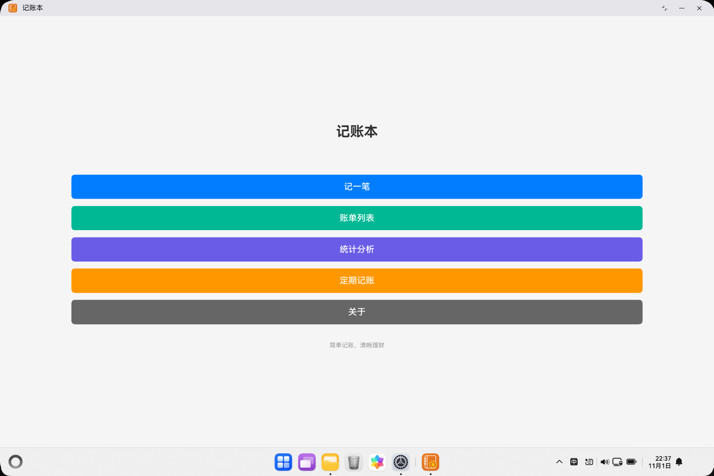
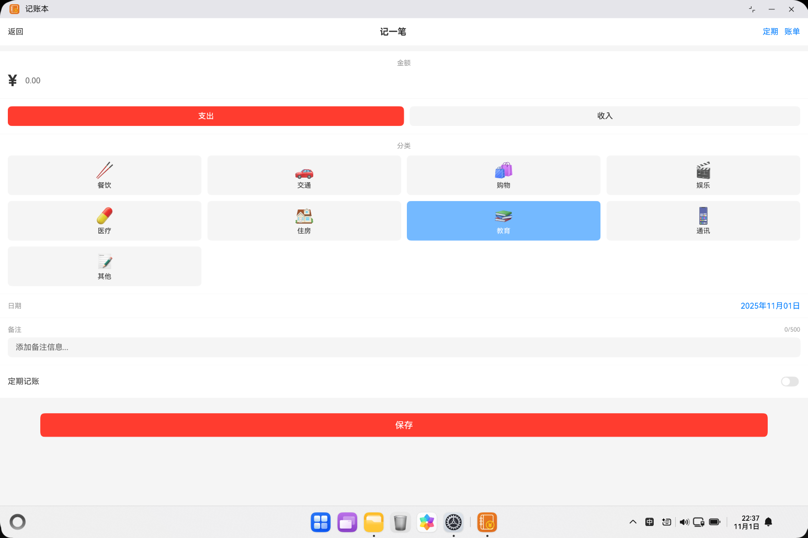
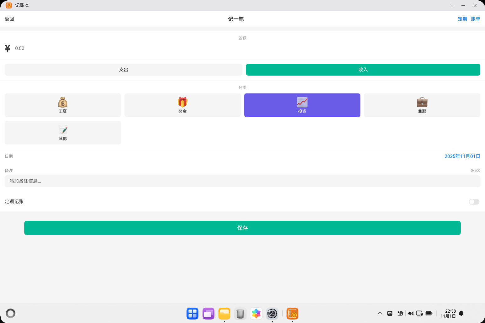
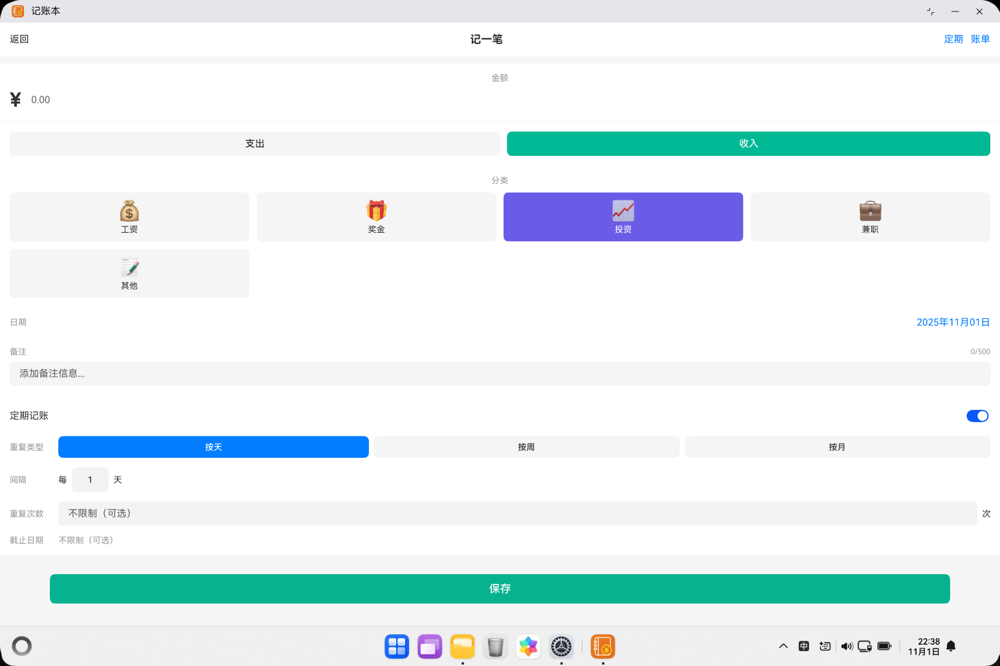
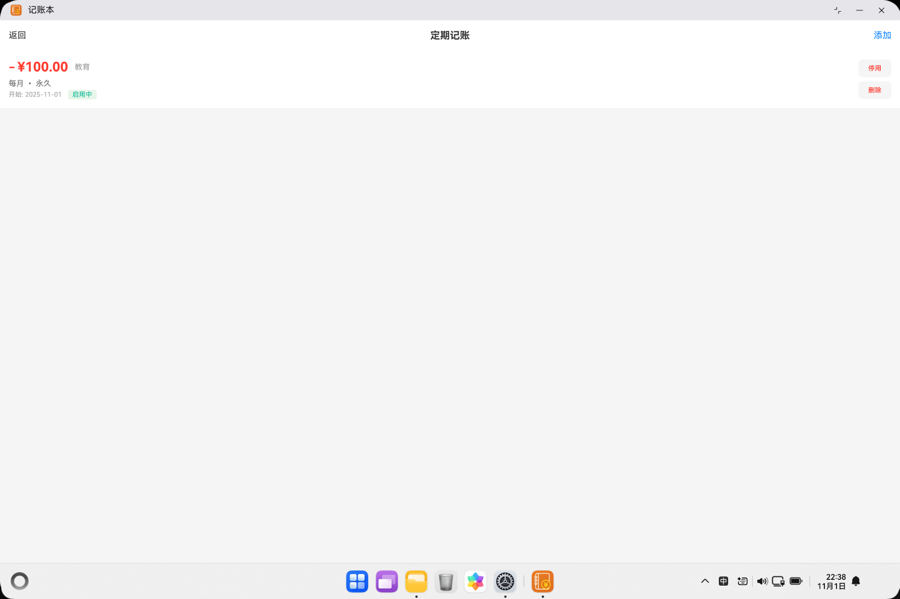
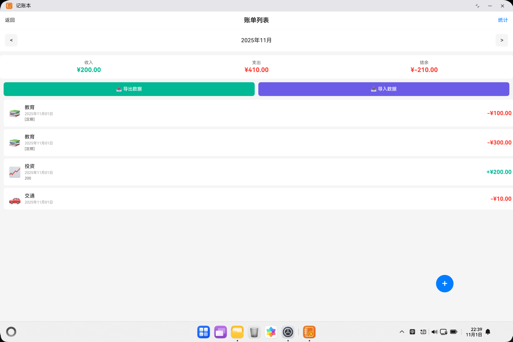
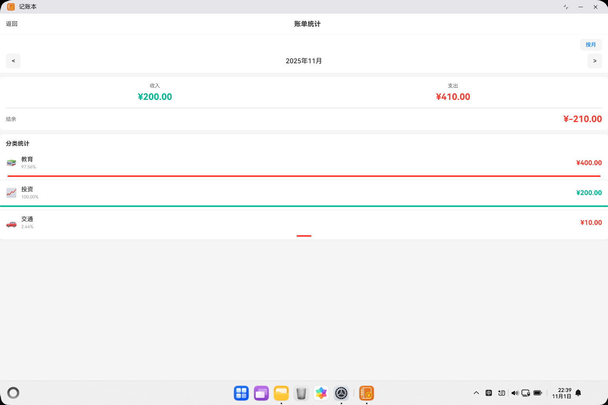
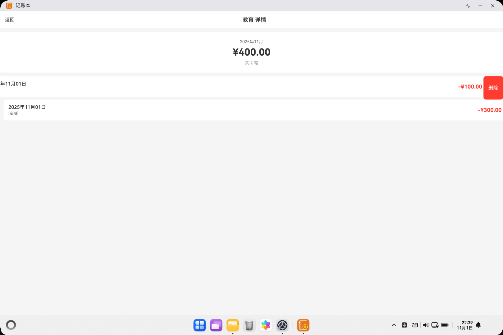

# 记账本应用 - 快速开始指南

## 🎉 已实现的功能

### ✅ 核心功能
1. **记账功能** - 记录收入和支出,支持多种分类
2. **账单列表** - 查看和管理账单,按月份筛选
3. **统计分析** - 按年月和分类统计,支持柱状图、折线图、累积图多维度可视化展示
4. **定期记账** - 支持按天/周/月自动生成账单
5. **数据持久化** - 使用关系型数据库存储

### ✅ 技术特性
- 使用ArkTS开发
- ArkUI声明式UI
- RelationalStore数据库
- 完整的CRUD操作
- 路由导航管理
- 自动化任务调度

## 📁 项目文件说明

### 1. 数据模型层 (models/)
- `BillModel.ets` - 账单数据模型、分类定义、枚举类型

### 2. 数据库层 (database/)
- `BillDatabase.ets` - 关系型数据库管理类,提供增删改查方法

### 3. 工具类 (utils/)
- `BillStatisticsUtil.ets` - 账单统计计算工具
- `DateUtil.ets` - 日期时间处理工具

### 4. 页面层 (pages/)
- `Index.ets` - 应用主页,数据库初始化
- `AddBillPage.ets` - 添加账单页面,支持定期记账配置
- `BillListPage.ets` - 账单列表页面
- `StatisticsPage.ets` - 统计分析页面
- `CategoryDetailPage.ets` - 分类详情页面
- `RecurringBillManagePage.ets` - 定期记账管理页面

## 🚀 如何运行

### 方法1: 使用DevEco Studio
1. 打开DevEco Studio
2. 选择 File -> Open -> 选择项目目录
3. 等待项目索引完成
4. 连接设备或启动模拟器
5. 点击运行按钮 ▶️

### 方法2: 使用命令行
```bash
# 进入项目目录
cd d:\Code\HarmonyOS\MyApplication

# 构建项目
hvigorw assembleHap

# 安装到设备
hdc install entry/build/default/outputs/default/entry-default-signed.hap
```

## 📱 使用流程

### 第一次使用
1. **启动应用** - 应用会自动初始化数据库
2. **记一笔** - 点击主页"记一笔"按钮开始记账
3. **选择类型** - 选择支出或收入
4. **选择分类** - 从预定义分类中选择
5. **输入金额** - 输入账单金额
6. **保存** - 点击保存按钮

### 查看账单
1. **进入列表** - 点击主页"账单列表"
2. **切换月份** - 使用 < > 按钮切换查看不同月份
3. **查看统计** - 页面顶部显示收入、支出、结余
4. **删除账单** - 左滑账单可删除

### 统计分析
1. **进入统计** - 点击主页"统计分析"或列表页"统计"
2. **切换模式** - 在按月/按年/全部三种统计模式间切换
3. **查看总览** - 查看收支总览卡片
4. **图表分析** - 切换三种图表类型：
   - **柱状图** - 直观对比每日/每月收支
   - **趋势图** - 折线图展示收支变化趋势
   - **累积图** - 追踪累积收入、支出和结余
5. **查看分类** - 查看各分类支出占比和进度条
6. **查看详情** - 点击分类查看该分类的所有账单

## 🎨 界面预览

### 1. 主页
应用主页提供三个主要入口,简洁清晰。



### 2. 记一笔 - 普通记账
快速记录收入和支出,支持自定义金额、分类、日期和备注。



### 3. 记一笔 - 定期记账配置
开启定期记账开关后,可配置按天/周/月自动生成账单。



### 4. 定期记账管理 - 配置列表
查看所有定期记账配置,支持启用/禁用和删除操作。



### 5. 定期记账管理 - 删除选项
删除定期配置时可选择是否同时删除已生成的账单。



### 6. 账单列表
按月查看账单,显示收入、支出和结余统计,支持滑动删除。



### 7. 统计分析
按年月统计收支情况,查看各分类支出占比。



### 8. 设置/管理
提供暗黑模式切换等设置选项。



## 📊 数据结构

### 账单表 (bills)
| 字段 | 类型 | 说明 |
|-----|------|------|
| id | INTEGER | 主键,自增 |
| amount | REAL | 金额 |
| type | TEXT | 类型(income/expense) |
| category | TEXT | 分类 |
| date | TEXT | 日期(YYYY-MM-DD) |
| note | TEXT | 备注 |
| createTime | TEXT | 创建时间戳(ISO 8601格式) |

**排序规则**: 按 `date` 降序,然后按 `createTime` 降序

## 🔧 调试技巧

### 1. 查看日志
```bash
hdc shell hilog | grep BillDatabase
```

### 2. 清空数据库(测试用)
在代码中可以调用:
```typescript
await billDb.clearAllBills();
```

### 3. 检查数据库
```bash
hdc shell
cd /data/app/el2/100/database/com.example.myapplication
ls -la
```

## ⚠️ 注意事项

1. **首次启动** - 应用会自动创建数据库,无需手动操作
2. **数据备份** - 目前不支持自动备份,请注意数据安全
3. **删除操作** - 删除账单不可恢复,请谨慎操作
4. **金额输入** - 只支持数字输入,自动保留两位小数
5. **排序规则** - 账单按日期降序,同一天按创建时间降序
6. **分类记忆** - 应用会记住上次选择的分类,方便连续记账

## 🐛 常见问题

### Q1: 应用启动时显示"正在初始化"?
A: 这是正常现象,等待几秒数据库初始化完成即可。

### Q2: 点击保存后没有反应?
A: 请检查是否输入了有效的金额(大于0的数字)。

### Q3: 账单列表为空?
A: 首次使用时没有数据,需要先添加账单。

### Q4: 如何修改账单?
A: 当前版本暂不支持修改,可以删除后重新添加。

### Q5: 为什么同一天的账单顺序不一样?
A: 同一天的账单按创建时间降序排列,最新添加的显示在最前面。

## 📆 定期记账功能

### 功能概述
定期记账功能允许配置自动生成的周期性账单,适用于固定收入和支出场景(如工资、房租、订阅服务等)。

### 重复类型
- **按天** - 每隔N天重复(如每天、每2天)
- **按周** - 每隔N周重复(如每周、每2周)
- **按月** - 每隔N月重复(如每月、每2月)

### 配置选项
1. **开始日期** - 可选择任意日期(支持历史、今天或未来日期)
2. **截止日期** - 可选,到期后自动停用
3. **重复次数** - 可选,达到次数后自动停用

### 使用流程

#### 1. 创建定期记账
1. 进入"记一笔"页面
2. 填写金额、类型、分类等基本信息
3. 开启"定期记账"开关
4. 选择重复类型(按天/周/月)
5. 设置间隔(如每2天)
6. 可选设置重复次数或截止日期
7. 点击保存

**示例**: 每月房租
- 金额: 3000
- 类型: 支出
- 分类: 住房
- 重复: 每月
- 开始: 2025-11-01
- 截止: 2026-10-31

#### 2. 自动生成机制
- **触发时机**: APP启动时自动检测
- **防重复**: 通过生成记录表避免重复
- **账单标识**: 自动添加`[定期]`前缀
- **即时生成**: 保存配置后立即生成当前应生成的账单

#### 3. 管理定期配置
1. 进入"定期记账"管理页面
2. 查看所有配置(启用/停用状态)
3. 可随时启用或停用配置
4. 删除配置时可选:
   - 仅删除配置(保留已生成账单)
   - 删除配置和账单(同时删除)

### 数据结构

#### 定期配置表 (recurring_bill_configs)
| 字段 | 类型 | 说明 |
|-----|------|------|
| id | INTEGER | 主键,自增 |
| amount | REAL | 金额 |
| type | TEXT | 类型(income/expense) |
| category | TEXT | 分类 |
| note | TEXT | 备注 |
| recurringType | TEXT | 重复类型(daily/weekly/monthly) |
| interval | INTEGER | 间隔 |
| repeatCount | INTEGER | 重复次数(可选) |
| endDate | TEXT | 截止日期(可选) |
| startDate | TEXT | 开始日期 |
| lastGeneratedDate | TEXT | 最后生成日期 |
| isActive | INTEGER | 是否启用(1/0) |
| createTime | TEXT | 创建时间 |

#### 生成记录表 (generated_bill_records)
| 字段 | 类型 | 说明 |
|-----|------|------|
| id | INTEGER | 主键,自增 |
| recurringConfigId | INTEGER | 关联配置ID(软外键) |
| generatedDate | TEXT | 生成账单日期 |
| billId | INTEGER | 生成的账单ID(软外键) |
| createTime | TEXT | 创建时间 |

### 技术特点

1. **软外键设计**
   - 用户可自由删除账单或配置
   - 数据灵活管理,互不影响

2. **智能生成**
   - 自动计算缺失的账单日期
   - 批量生成历史账单
   - 自动更新配置状态

3. **自动禁用**
   - 达到截止日期后自动禁用
   - 达到重复次数后自动禁用
   - 避免手动管理

4. **即时反馈**
   - 配置保存后立即生成
   - Toast提示生成数量
   - 账单备注添加`[定期]`标识

### 使用场景示例

**场景1: 每月工资**
- 金额: 10000
- 类型: 收入
- 分类: 工资
- 重复: 每月
- 开始: 2025-11-05
- 结束: 不限制

**场景2: 房租**
- 金额: 3000
- 类型: 支出
- 分类: 住房
- 重复: 每月
- 开始: 2025-11-01
- 截止: 2026-10-31 (租期1年)

**场景3: 健身卡月费**
- 金额: 299
- 类型: 支出
- 分类: 娱乐
- 重复: 每月
- 开始: 2025-11-01
- 次数: 12次 (1年)

### 注意事项

1. ✅ 开始日期支持历史、今天或未来日期
2. ✅ 截止日期必须晚于开始日期
3. ✅ 可同时设置截止日期和重复次数(以先到达为准)
4. ✅ 删除配置不影响已生成账单(可选)
5. ✅ 配置到期后自动停用
6. ✅ 每次APP启动自动生成应生成的账单

## 📈 下一步计划

- [ ] 支持账单编辑功能
- [ ] 添加搜索功能
- [ ] 图表可视化(饼图、折线图)
- [ ] 数据导入导出(JSON/CSV)
- [ ] 预算管理
- [ ] 多账本支持
- [x] ~~周期性账单(如每月固定支出)~~ ✅ 已完成
- [ ] 账单图片附件
- [ ] 定期账单更复杂的规则(如每月第一天、每周一等)
- [ ] 定期账单预览功能
- [ ] 定期账单通知提醒

## 📞 技术支持

如果遇到问题,请查看:
- [HarmonyOS开发文档](https://developer.huawei.com/consumer/cn/doc/)
- [ArkTS开发指南](https://developer.huawei.com/consumer/cn/doc/harmonyos-guides-V5/arkts-get-started-V5)
- [关系型数据库开发](https://developer.huawei.com/consumer/cn/doc/harmonyos-guides-V5/data-persistence-by-rdb-store-V5)
- 项目详细说明: [README.md](README.md)

## 🔗 相关文档

- [README.md](README.md) - 项目详细说明文档
- [FEATURE_UPDATE.md](FEATURE_UPDATE.md) - 功能更新日志
- [README_BILL_APP.md](README_BILL_APP.md) - 账单应用专题文档

---

**祝使用愉快!** 💰📊✨
